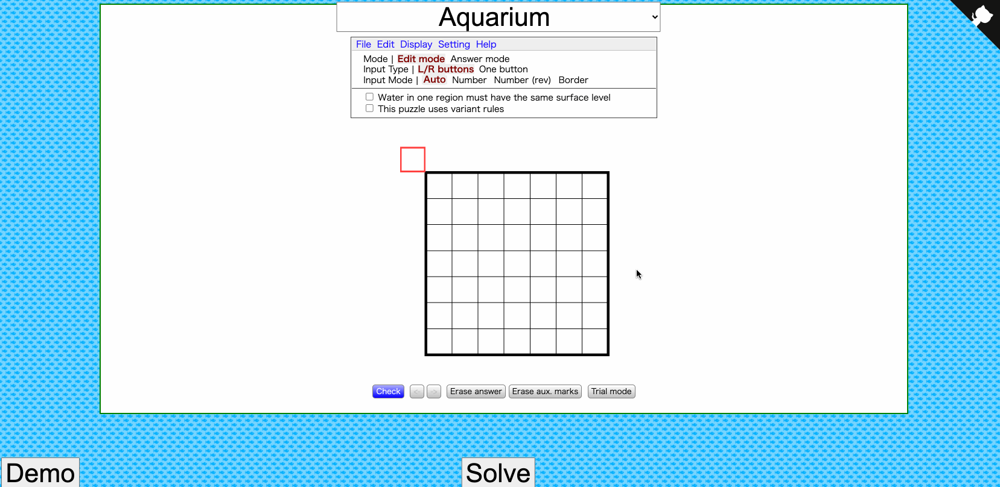

# Nikoli Puzzle Solver

Solver for over 30 types of Nikoli-style logic puzzles, including Sudoku, Slitherlink, Masyu, Nonograms, Skyscrapers, Light Up, Kakuro, and many more, conveniently deployed as a web app for easy use. Try it at https://util.in:8102.

This repository builds on top of the brilliant puzzle solver library [Grilops](https://github.com/obijywk/grilops). Some puzzle implementations are taken or inspired/improved from the [Grilops examples](https://github.com/obijywk/grilops/tree/master/examples), and others are new. It hooks up to the [Penpa UI](https://github.com/swaroopg92/penpa-edit) to make it easy to input and view puzzles.

## Instructions

- Go to https://util.in:8102.
- Input a puzzle, or click "Demo" on the bottom left to load a sample puzzle. (You can also click Load to load any Penpa URL from the web.)
- In the dropdown menu on the bottom right, select the desired puzzle type/rules to solve with.
- Click "Solve". The grid will be automatically filled if a solution is found. Requests will time out if no solution is found after 30 seconds.

## Development

### One-time setup

Install [Poetry](https://python-poetry.org/docs/), Python's dependency manager.

In the root directory, run:

    poetry install  # note: building the z3 library may take a long time, up to 20 min, on some machines
    git submodule update --init

### Running the server

In the root directory, run:

    poetry shell
    flask run

Then go to http://localhost:5000.

### Adding a solver

- Implement a new subclass of [AbstractSolver](solvers/abstract_solver.py) in the `solvers` directory.
- Update `supported_puzzles.yml` with the puzzle type, and a sample puzzle and its solution.
    - You can construct the sample puzzle in Penpa, and click "Share" -> "Editing URL" to get the encoded puzzle.
- Run the tests with `poetry run pytest` to verify the new solver implementation and sample puzzle are correct.

